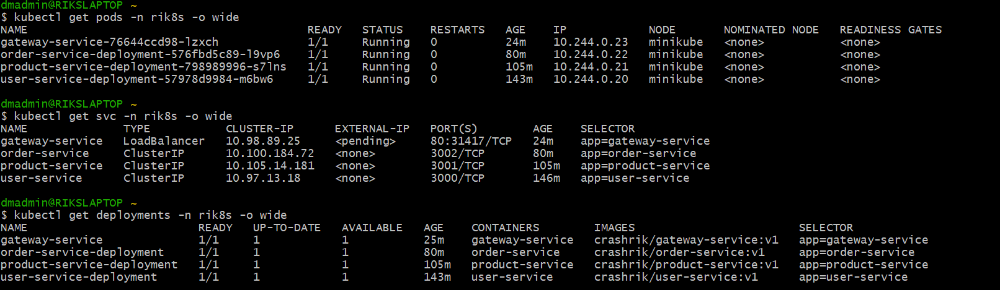
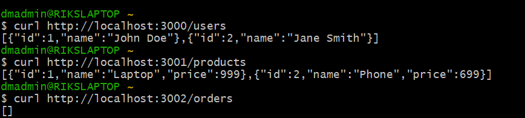
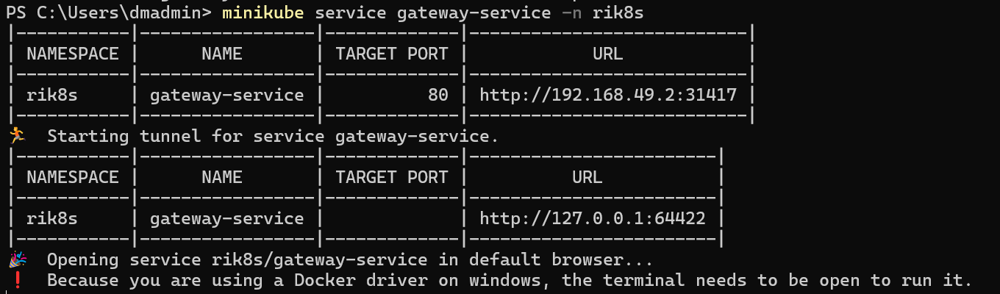
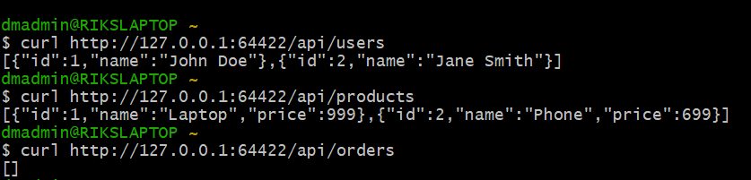

# Microservices-Task

## Overview
This document details deploying a microservices application on Kubernetes using Minikube. The stack includes User, Product, Order, and Gateway services, each with its own endpoints for testing.

---

## 1. Local Testing of Services and Endpoints

### **User Service**
- **Base URL:** `http://localhost:3000`
- **List Users:**  
  ```bash
  curl http://localhost:3000/users
  ```
  Or open: [http://localhost:3000/users](http://localhost:3000/users)

---

### **Product Service**
- **Base URL:** `http://localhost:3001`
- **List Products:**  
  ```bash
  curl http://localhost:3001/products
  ```
  Or open: [http://localhost:3001/products](http://localhost:3001/products)

---

### **Order Service**
- **Base URL:** `http://localhost:3002`
- **List Orders:**  
  ```bash
  curl http://localhost:3002/orders
  ```
  Or open: [http://localhost:3002/orders](http://localhost:3002/orders)

---

### **Gateway Service**
- **Base URL:** `http://localhost:3003/api`
- **Endpoints:**
  - **Users:**  
    ```bash
    curl http://localhost:3003/api/users
    ```
  - **Products:**  
    ```bash
    curl http://localhost:3003/api/products
    ```
  - **Orders:**  
    ```bash
    curl http://localhost:3003/api/orders
    ```

---

## 2. Kubernetes Setup & Testing with Minikube

1. **Start Minikube:**
   ```bash
   minikube start
   ```

2. **Create Namespace (if not exists):**
   ```bash
   kubectl create namespace rik8s
   ```

3. **Apply Deployment Manifests:**
   ```bash
   kubectl apply -f .\user-deployments.yaml
   kubectl apply -f .\product-deployments.yaml 
   kubectl apply -f .\order-deployments.yaml
   kubectl apply -f .\gateway-deployments.yaml
   ```

4. **Apply Service Manifests:**
   ```bash
   kubectl apply -f .\user-service.yaml
   kubectl apply -f .\product-service.yaml
   kubectl apply -f .\order-service.yaml
   kubectl apply -f .\gateway-service.yaml   
   ```

5. **Check Status of Deployments, Services, and Pods:**
   ```bash
   kubectl get deployments -n rik8s
   kubectl get pods -n rik8s
   kubectl get svc -n rik8s
   kubectl get rs -n rik8s
   ```

6. **Access User/Product/Order Services:**
   - If using Ingress, ensure it is applied and configured.
   - For local testing, use port-forward:
     ```bash
     kubectl port-forward svc/user-service 3000:3000 -n rik8s
     kubectl port-forward svc/product-service 3001:3001 -n rik8s
     kubectl port-forward svc/order-service  3002:3002 -n rik8s
     ```

7. **Expose Gateway Service for Local Testing:**
   - With Minikube, use:
     ```bash
     minikube service gateway-service -n rik8s
     ```
   - Or, if using NodePort, access via Minikube IP and NodePort (see below).

8. **Optional: Launch Minikube Dashboard**
   ```bash
   minikube dashboard
   ```

---

## 3. Demo

1. **K8s Services Overview:**  
   

2. **All Services Running:**  
   

3. **Gateway Service running using minikube:**  
   

4. **Gateway API Testing with `curl`:**  
   

---

## Notes

- If the `EXTERNAL-IP` for your `gateway-service` shows `<pending>`, it's because the `LoadBalancer` type requires a cloud provider. Minikube does not provide a cloud load balancer by default.
- **Solution:** Change the service type to `NodePort` in your `gateway-service.yaml`:

  ```yaml
  spec:
    type: NodePort
    selector:
      app: gateway-service
    ports:
      - protocol: TCP
        port: 80
        targetPort: 3003
        nodePort: 31417 # optional, or let Kubernetes assign
  ```

- **Access the Gateway Service:**  
  Get your Minikube IP:
  ```bash
  minikube ip
  ```
  Then open in your browser:
  ```
  http://<minikube-ip>:31417/
  ```
---
## Ingress work-in progress